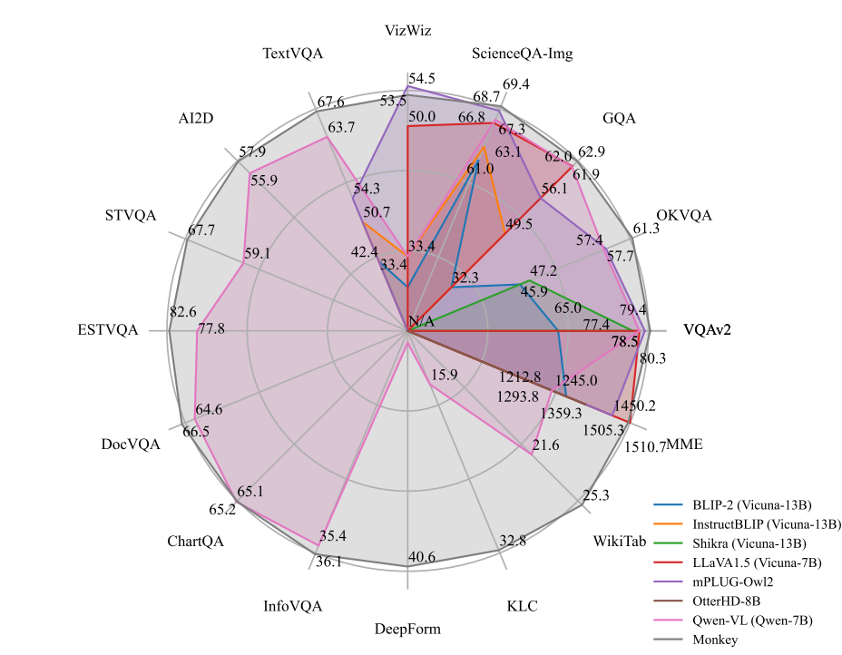
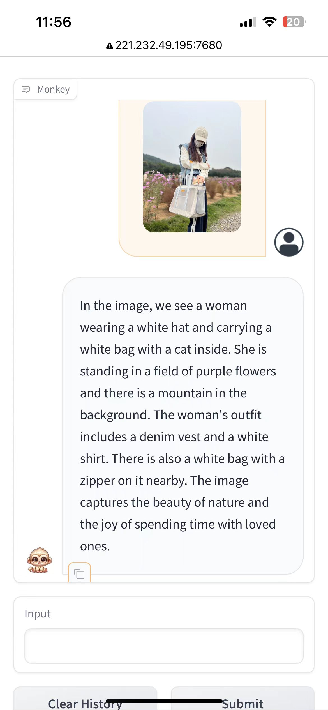
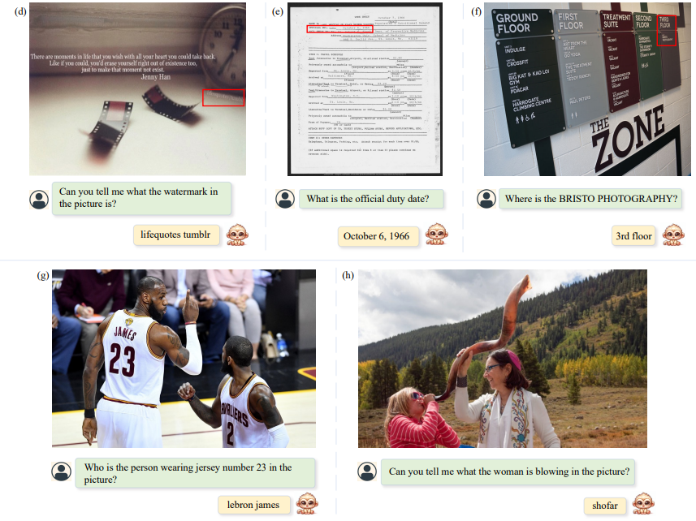
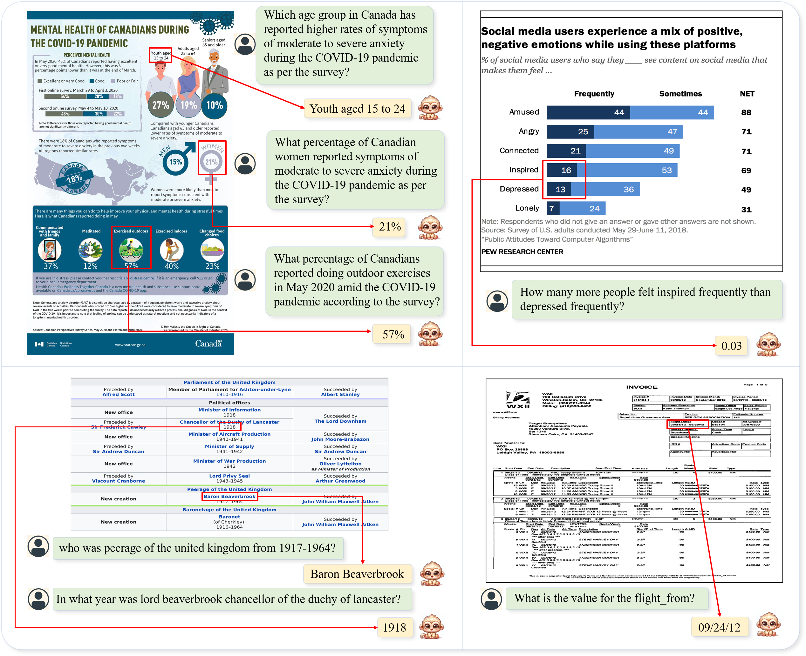

# Monkey: Image Resolution and Text Label Are Important Things for Large Multi-modal Models

 

    

 

Zhang Li*, Biao Yang*, Qiang Liu, Zhiyin Ma, Shuo Zhang, Jingxu Yang, Yabo Sun, Yuliang Liu†, Xiang Bai†

<strong>Huazhong University of Science and Technology, Kingsoft</strong>

<a href="updating">Paper</a>&nbsp&nbsp | &nbsp&nbsp<a href="https://53965e0026f6da5097.gradio.live">Demo</a>&nbsp&nbsp | &nbsp&nbsp<a href="Monkey Model">Monkey Models</a>&nbsp ｜ &nbsp <a href="updating">Tutorial</a>

-----

**Monkey** brings a training-efficient approach to effectively improve the input resolution capacity up to 896 x 1344 pixels without pretraining from the start. To bridge the gap between simple text labels and high input resolution, we propose a multi-level description generation method, which automatically provides rich information that can guide the model to learn the contextual association between scenes and objects. With the synergy of these two designs, our model achieved excellent results on multiple benchmarks. By comparing our model with various LMMs, including GPT4V, our model demonstrates promising performance in image captioning by paying attention to textual information and capturing fine details within the images; its improved input resolution also enables remarkable performance in document images with dense text. 

## Spotlights

- **Contextual associations.**. Our method demonstrates a superior ability to infer the relationships between targets more effectively when answering questions, which results in delivering more comprehensive and insightful results.
- **Support resolution up to 1344 x 896.** Surpassing the standard 448 x 448 resolution typically employed for LMMs, this significant increase in resolution augments the ability to discern and understand unnoticeable or tightly clustered objects and dense text. 
- **Enhanced general performance.** We carried out testing across 16 diverse datasets, leading to impressive performance by our Monkey model in tasks such as Image Captioning, General Visual Question Answering, Text-centric Visual Question Answering, and Document-oriented Visual Question Answering.

## performance

 

    

 

## Demo

Have a try using the providing [Demo](https://53965e0026f6da5097.gradio.live). All you need are to simpley upload or capture image from desktop or your phone, then click the generate. You will get like:

 

    

 

## Cases

Our model can accurately describe the details in the image.

 

    

 

Besides, our model has also demonstrated some capabilities in fine-grained question answering.

 

    

 

We have also achieved impressive performance on document-based tasks.

 

    

 

We qualitatively compare with existing LMMs including GPT4V, Qwen-vl, etc, which shows inspiring results. One can have a try using the provided demo. 

 

    

 

## Acknowledgement

[Qwen-VL](https://github.com/QwenLM/Qwen-VL.git): the codebase we built upon. Thanks for the authors of Qwen for providing the framework.

​    
## Copyright
We welcome suggestions to help us improve the little Monkey. For any query, please contact Dr. Yuliang Liu: ylliu@hust.edu.cn
