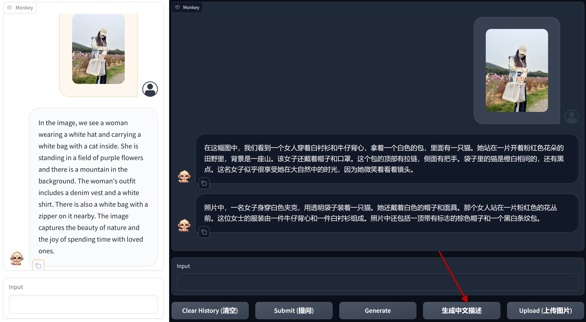

# Monkey: Image Resolution and Text Label Are Important Things for Large Multi-modal Models


<br>
<p align="center">
    
<p>
<br>

<div align="center">
Zhang Li*, Biao Yang*, Qiang Liu, Zhiyin Ma, Shuo Zhang, Jingxu Yang, Yabo Sun, Yuliang Liu†, Xiang Bai†
</div>
<div align="center">
<strong>Huazhong University of Science and Technology, Kingsoft</strong>
</div>
<p align="center">
<a href="https://arxiv.org/abs/2311.06607">Paper</a>&nbsp&nbsp | &nbsp&nbsp<a href="http://27.17.252.152:7680/">Demo</a>&nbsp&nbsp | &nbsp&nbsp<a href="[updating](http://huggingface.co/echo840/Monkey)">Model</a>&nbsp&nbsp 
<!--     | &nbsp&nbsp<a href="Monkey Model">Monkey Models</a>&nbsp ｜ &nbsp <a href="http://huggingface.co/echo840/Monkey">Tutorial</a> -->
</p>

-----

**Monkey** brings a training-efficient approach to effectively improve the input resolution capacity up to 896 x 1344 pixels without pretraining from the start. To bridge the gap between simple text labels and high input resolution, we propose a multi-level description generation method, which automatically provides rich information that can guide the model to learn the contextual association between scenes and objects. With the synergy of these two designs, our model achieved excellent results on multiple benchmarks. By comparing our model with various LMMs, including GPT4V, our model demonstrates promising performance in image captioning by paying attention to textual information and capturing fine details within the images; its improved input resolution also enables remarkable performance in document images with dense text. 
    

## Spotlights

- **Contextual associations.** Our method demonstrates a superior ability to infer the relationships between targets more effectively when answering questions, which results in delivering more comprehensive and insightful results.
- **Support resolution up to 1344 x 896.** Surpassing the standard 448 x 448 resolution typically employed for LMMs, this significant increase in resolution augments the ability to discern and understand unnoticeable or tightly clustered objects and dense text. 
- **Enhanced general performance.** We carried out testing across 16 diverse datasets, leading to impressive performance by our Monkey model in tasks such as Image Captioning, General Visual Question Answering, Text-centric Visual Question Answering, and Document-oriented Visual Question Answering.

## Environment

```python
conda create -n monkey python=3.9
conda activate monkey
git clone https://github.com/Yuliang-Liu/Monkey.git
cd ./Monkey
pip install -r requirements.txt
```


## Demo

[Demo](http://27.17.252.152:7680/) is fast and easy to use. Simply uploading an image from your desktop or phone, or capture one directly. Before 14/11/2023, we have observed that for some random pictures Monkey can achieve more accurate results than GPT4V.  
<br>
<p align="center">
    
<p>
<br>

For those who prefer responses in Chinese, use the '生成中文描述' button to get descriptions in Chinese.

<br>
<p align="center">
    
<p>
<br>
We also provide the source code for the demo, allowing you to customize certain parameters for a more unique experience. The specific operations are as follows:

 1. Make sure you have configured the [environment](#environment).
 2. You can choose to use the demo offline or online:
- **Offline:** 
	- Download the [Model Weight](http://huggingface.co/echo840/Monkey). 
	- Modify `DEFAULT_CKPT_PATH="pathto/Monkey"` in the `demo.py` file to your model weight path. 
	- Run the demo using the following command: 
	```
	python demo.py
	```
- **Online:** 
	- Run the demo and download model weights online with the following command: 
	```
	python demo.py -c echo840/Monkey 
	```

## Dataset

We have open-sourced the data generated by the multi-level description generation method. You can download it at [Detailed Caption](https://huggingface.co/datasets/echo840/Detailed_Caption).

## Evaluate

We offer evaluation code for 14 Visual Question Answering (VQA) datasets in the `evaluate_vqa.py` file, facilitating a quick verification of results.  The specific operations are as follows:

 1. Make sure you have configured the [environment](#environment).
 2. Modify `sys.path.append("pathto/Monkey")`  to your model weight path.
 3. Prepare the datasets required for evaluation. 
 4. Run the evaluation code.

 Take ESTVQA as an example:
 - Prepare data according to the following directory structure:
```
├── data
|	├── estvqa
|		├── test_image
|			├── {image_path0}
|			├── {image_path1}
|					  ·
|					  ·
|		├── estvqa.jsonl
```
 - Example of the format of each line of the annotated `.jsonl` file:
```
{"image": "data/estvqa/test_image/011364.jpg", "question": "What is this store?", "answer": "pizzeria", "question_id": 0}
```
 - Modify the dictionary `ds_collections`:
```
ds_collections = {
	'estvqa_test': {
	'test': 'data/estvqa/estvqa.jsonl',
	'metric': 'anls',
	'max_new_tokens': 100,
	},
	...
}
```
 - Run the following command:
```
bash eval/eval.sh 'EVAL_PTH' 'SAVE_NAME'
```

## Train

We also offer Monkey's model definition and training code, which you can explore above. You can execute the training code through executing `finetune_ds_debug.sh`.

**ATTENTION:** Specify the path to your training data, which should be a json file consisting of a list of conversations.


## Performance

<br>

<p align="center">
    
<p>
<br>


## Cases

Our model can accurately describe the details in the image.

<br>
<p align="center">
    
<p>
<br>

Besides, our model has also demonstrated some capabilities in fine-grained question answering.

<br>
<p align="center">
    
<p>
<br>

We have also achieved impressive performance on document-based tasks.

<br>
<p align="center">
    
<p>
<br>

We qualitatively compare with existing LMMs including GPT4V, Qwen-vl, etc, which shows inspiring results. One can have a try using the provided demo. 

<br>
<p align="center">
    
<p>
<br>

## Citing Monkey
If you wish to refer to the baseline results published here, please use the following BibTeX entries:

```BibTeX
@article{li2023monkey,
  title={Monkey: Image Resolution and Text Label Are Important Things for Large Multi-modal Models},
  author={Li, Zhang and Yang, Biao and Liu, Qiang and Ma, Zhiyin and Zhang, Shuo and Yang, Jingxu and Sun, Yabo and Liu, Yuliang and Bai, Xiang},
  journal={arXiv preprint arXiv:2311.06607},
  year={2023}
}
```

If you find the Monkey cute, please star. It would be a great encouragement for us.

## Acknowledgement

[Qwen-VL](https://github.com/QwenLM/Qwen-VL.git): the codebase we built upon. Thanks for the authors of Qwen for providing the framework.


## Copyright
We welcome suggestions to help us improve the Monkey. For any query, please contact Dr. Yuliang Liu: ylliu@hust.edu.cn. If you find something interesting, please also feel free to share with us through email or open an issue. Thanks!
